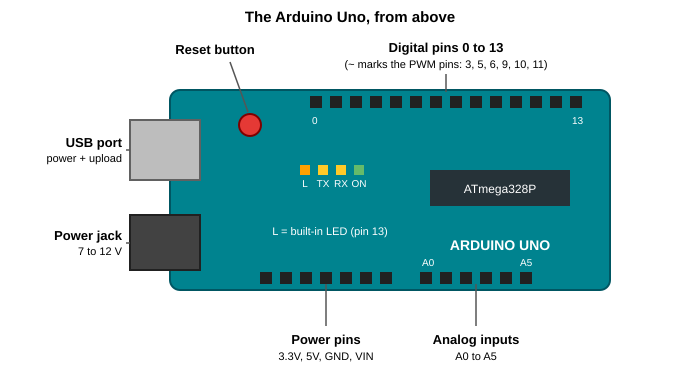
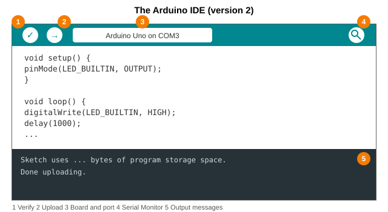
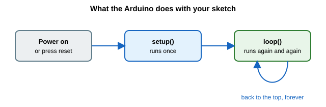
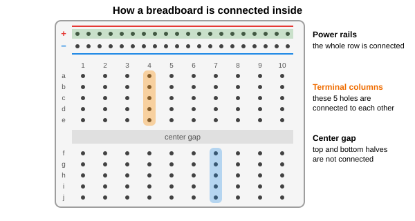

# Getting started with Arduino

This guide covers everything you need to go from an unopened box to a working first project. We'll look at what an Arduino is, what's on the board, how to install the software, how to upload your first program, and how to use the Serial Monitor and a breadboard. At the end there's a quick reference of the commands you'll use most, some fixes for common problems, and suggestions for what to build next.

It's written for the Arduino Uno, which is the most common board for beginners. Other boards work in much the same way.

## What is an Arduino?

An Arduino is a small circuit board built around a microcontroller, which is a tiny computer on a single chip. It's designed to do one job at a time: read things from the outside world, make a decision, and control something in response.

The "things from the outside world" are inputs, such as buttons, light sensors, temperature sensors and potentiometers. The "something you control" is an output, such as an LED, a buzzer, a motor or a display.

It isn't like a laptop or a Raspberry Pi. There's no operating system and no screen. It runs a single program that you write, it starts within a moment of being powered on, and it keeps running that program until you unplug it or upload a different one. A program for an Arduino is called a **sketch**.

## What you need

To follow this guide and the others that come after it:

- An Arduino Uno (or a compatible clone)
- A USB cable. The Uno uses a USB-B connector, the squarish one you see on printers. Make sure it's a data cable, because some cheap ones only carry power.
- A computer running Windows, macOS or Linux
- A breadboard and some jumper wires
- A few LEDs, 220 Ω and 10 kΩ resistors, push buttons and a potentiometer

You can buy these separately, but a starter kit usually has all of it in one box.

## A tour of the Uno



- **USB port:** connects to your computer. It powers the board and it's also how you upload programs.
- **Power jack:** an optional connector for a wall adapter or battery pack, from 7 to 12 V.
- **Reset button:** restarts your sketch from the beginning.
- **Digital pins 0 to 13:** these can be inputs or outputs and deal in two states, `HIGH` (5 V) and `LOW` (0 V). The ones marked with a `~` (3, 5, 6, 9, 10 and 11) can also do PWM, which lets you fake in-between voltages.
- **Analog inputs A0 to A5:** these read a voltage anywhere between 0 and 5 V and turn it into a number from 0 to 1023.
- **Power pins:** `5V`, `3.3V` and `GND` (ground, the 0 V reference). `VIN` is for feeding power in from an outside supply.
- **ATmega328P:** the microcontroller itself, the chip that runs your sketch.
- **Small LEDs:** `ON` lights when there's power. `TX` and `RX` blink when data goes over USB. `L` is a built-in LED connected to pin 13, which is handy for testing without any wiring.

For the curious, the chip runs at 16 MHz and has 32 KB of memory for your program and 2 KB for variables.

## Installing the software

The Arduino IDE (integrated development environment) is where you write sketches, and it's free. Download it from [arduino.cc/en/software](https://www.arduino.cc/en/software), run the installer, and open it. There's also a browser-based option called the Arduino Cloud Editor if you'd rather not install anything.

A few notes on specific systems:

- **Windows:** the installer offers to install drivers. Say yes.
- **Linux:** you may need permission to use the USB port. If uploading fails with "permission denied", run `sudo usermod -a -G dialout $USER`, then log out and back in.
- **Clone boards:** many cheaper Uno-style boards use a chip called CH340 for USB, which can need its own driver. If your computer doesn't detect the board, search for "CH340 driver" for your system.

## Connecting the board

Plug the board into your computer with the USB cable. The `ON` light should come on.

Then tell the IDE what you've plugged in:

1. Go to **Tools > Board > Arduino AVR Boards** and choose **Arduino Uno**.
2. Go to **Tools > Port** and choose the port with the Arduino on it. On Windows it looks like `COM3`, on macOS `/dev/cu.usbmodem...` and on Linux `/dev/ttyACM0`.

Newer versions of the IDE often detect the board automatically, and the board name and port appear at the top of the window.



The parts of the window you'll use most:

1. **Verify:** checks your code for mistakes and compiles it, without uploading.
2. **Upload:** compiles the code and sends it to the board.
3. **Board and port:** shows what the IDE thinks is connected.
4. **Serial Monitor:** opens a window for messages from the board.
5. **Output:** shows errors and progress messages.

## Your first sketch: Blink

The board has an LED built in, so you can run your first program without wiring anything.

Open **File > Examples > 01.Basics > Blink**. It looks like this:

```cpp
void setup() {
  pinMode(LED_BUILTIN, OUTPUT);
}

void loop() {
  digitalWrite(LED_BUILTIN, HIGH);   // LED on
  delay(1000);                       // wait one second
  digitalWrite(LED_BUILTIN, LOW);    // LED off
  delay(1000);                       // wait one second
}
```

Click **Upload**. The IDE compiles the code, the `TX` and `RX` lights flicker as it transfers, and when it's done the `L` LED starts blinking once a second. That's your first working Arduino program.

Change the two `1000` values to `200` and upload again, and it blinks much faster. Numbers in `delay()` are milliseconds, so 1000 is one second.

## How a sketch works

Every sketch has two main parts.



- `setup()` runs once, when the board powers up or is reset. It's where you get things ready, like telling a pin to be an output.
- `loop()` runs over and over for as long as the board has power. It's where the main work happens.

Once you upload a sketch, it's stored on the board and stays there when you unplug it. Plug the board into any USB charger and it starts running straight away, no computer needed.

Some rules of the language that catch beginners out:

- Most lines end with a semicolon `;`. Forgetting one is the most common error.
- Code blocks sit inside curly braces `{ }`, and every opening brace needs a closing one.
- Capital letters matter. `digitalWrite` works, `DigitalWrite` doesn't.
- Anything after `//` on a line is a comment, which the Arduino ignores. Use them to leave notes for yourself.

You'll also meet variables, which store values. The ones you'll use most are:

```cpp
const int ledPin = 8;      // a whole number that never changes
int count = 0;             // a whole number that can change
float volts = 3.3;         // a number with a decimal point
bool ledOn = false;        // true or false
```

Using `const int ledPin = 8;` and then writing `ledPin` in your code is better than typing `8` everywhere. If you move the LED to another pin, you change one line.

## The Serial Monitor

The Serial Monitor is how the Arduino talks back to you. You can print messages and readings to your computer, which is very useful for checking what your code is really doing.

```cpp
int counter = 0;

void setup() {
  Serial.begin(9600);            // start serial at 9600 baud
}

void loop() {
  Serial.print("Count: ");
  Serial.println(counter);       // println adds a new line
  counter = counter + 1;
  delay(1000);
}
```

Upload it, then open the Serial Monitor with the magnifying glass icon in the top right, or press `Ctrl+Shift+M` (`Cmd+Shift+M` on a Mac). Set the speed in the bottom corner to **9600 baud** to match `Serial.begin(9600)`, and you'll see the count go up every second. If you see garbled characters, the two speeds don't match.

## Breadboards

A breadboard lets you build circuits without soldering. The holes are connected together underneath in a fixed pattern, and you need to know it to wire anything correctly.



- **Terminal columns:** each group of 5 holes in a column is joined together. Two things plugged into the same column are connected.
- **The center gap:** the top and bottom halves are separate. It's there so a chip can sit across the middle with each side of pins in its own set of columns.
- **Power rails:** the long strips along the edges are connected along their whole length. They're for power (marked `+`, usually red) and ground (marked `−`, usually blue), so you can share one connection between many parts. On some boards the rails are split in the middle, so check yours.

Some habits that will save you trouble:

- Connect a wire from the Arduino's `GND` to the ground rail first.
- Use red wires for power and black wires for ground, and keep the wiring tidy.
- Unplug the USB cable before you change the wiring.

## Pins and power, in a nutshell

Digital pins can be inputs or outputs. Set the direction with `pinMode()`, then use `digitalWrite()` to drive a pin or `digitalRead()` to listen to it. Analog pins read a voltage with `analogRead()`, and PWM pins can fake an in-between voltage with `analogWrite()`. Pins 0 and 1 are also used for USB communication, so it's best to avoid them for anything else.

Ways to power the board:

- **USB:** the easiest, and what you'll use most of the time.
- **Power jack:** 7 to 12 V from a wall adapter or battery pack.
- **VIN pin:** the same 7 to 12 V, fed in through the pin.

A few limits to respect so you don't damage anything:

- Each pin can supply about 20 mA safely, with an absolute maximum of 40 mA. That's enough for an LED (with a resistor) but not for a motor. Motors need a transistor or a driver.
- Never put more than 5 V on a pin.
- Never connect `5V` directly to `GND`. That's a short circuit.
- Always use a resistor with an LED.

## The commands you'll use most

| Command | What it does |
|---|---|
| `pinMode(pin, OUTPUT)` | Sets a pin as an output (or `INPUT`, or `INPUT_PULLUP`) |
| `digitalWrite(pin, HIGH)` | Sets a pin to 5 V (or `LOW` for 0 V) |
| `digitalRead(pin)` | Reads a digital pin, gives `HIGH` or `LOW` |
| `analogRead(pin)` | Reads an analog pin, gives 0 to 1023 |
| `analogWrite(pin, value)` | PWM output on a `~` pin, value from 0 to 255 |
| `delay(ms)` | Pauses the program for that many milliseconds |
| `Serial.begin(9600)` | Starts serial communication |
| `Serial.println(x)` | Prints a value to the Serial Monitor |

## Common problems

- **The port is greyed out or missing:** try a different USB cable first, since many are charge-only. Then try another USB port. If it's a clone board, install the CH340 driver.
- **"Permission denied" on Linux:** add yourself to the `dialout` group as described above.
- **Upload fails with "not in sync":** the wrong board or port is selected. Check both under the Tools menu. Also unplug anything connected to pins 0 and 1, because those are used during upload.
- **A red error appears when you click Verify:** read the first line of the message. It usually names the line with the problem, and it's most often a missing semicolon or brace, or a typo.
- **The sketch uploads but nothing happens:** check the wiring, and check that the pin number in your code matches the pin you used.
- **The Serial Monitor shows odd characters:** the baud rate in the monitor doesn't match `Serial.begin()`.
- **Something gets hot:** unplug it straight away and check for a short circuit.

## Where to go next

These guides build on each other, in this order:

1. **Connecting LEDs** covers digital outputs, wiring LEDs and the traffic light project. ([guide](<lesson1(connecting LEDs).md)>))
2. **Buttons and digital inputs** covers reading a button and using it to control things. ([guide](<lesson_2_(buttons.md)>))
3. **PWM and potentiometers** covers analog input and dimming an LED. ([guide](../pwm-arduino/README.md))
4. **Light sensors** covers photoresistors, photodiodes and a night light. ([guide](../light-sensors-arduino/README.md))


## Further reading

- [Getting started with Arduino (official guide)](https://docs.arduino.cc/learn/starting-guide/getting-started-arduino/)
- [Arduino Uno Rev3 (official page)](https://docs.arduino.cc/hardware/uno-rev3/)
- [Arduino language reference](https://www.arduino.cc/reference/en/)
- [Blink example](https://docs.arduino.cc/built-in-examples/basics/Blink/)
- [Digital pins](https://docs.arduino.cc/learn/microcontrollers/digital-pins/)
- [Microcontroller (Wikipedia)](https://en.wikipedia.org/wiki/Microcontroller)
- [Breadboard (Wikipedia)](https://en.wikipedia.org/wiki/Breadboard)
