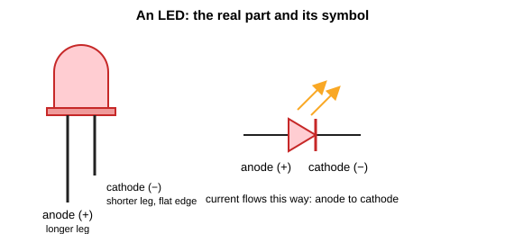
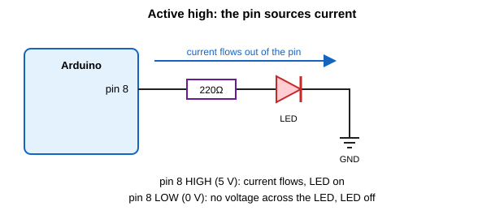
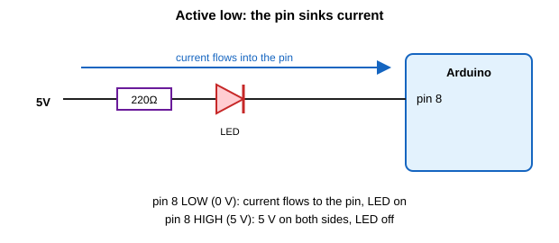
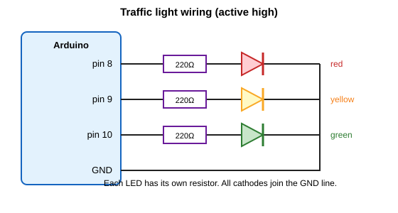

# Connecting LEDs to an Arduino

An LED is usually the first thing anyone connects to an Arduino, and it's a good way to learn how digital pins really work. This guide starts with what a digital pin is, then looks at the two ways to wire an LED (active high and active low), and finishes with a few activities: a blinker, an alternating flasher and a set of traffic lights.

The examples are written for an Arduino Uno.

## What you need

- Arduino Uno and a USB cable
- Three LEDs (red, yellow and green if you can)
- Three 220 Ω resistors (**1st digit**: red , **2nd Digit**: red, **Multiplier**: black, **tolerance**: gold)
- Breadboard and jumper wires

## Digital pins: inputs and outputs

A digital pin only deals with two states: `HIGH` (5 V on an Uno) and `LOW` (0 V). What you can do with it depends on which way you set it up.

- As an **input**, the pin listens. It measures the voltage on it and tells your program whether it's `HIGH` or `LOW`. A button is the classic example, and you read it with `digitalRead()`.
- As an **output**, the pin drives. Your program decides whether it's `HIGH` or `LOW`, and the pin pushes that voltage out. An LED is the classic example, and you control it with `digitalWrite()`.

You choose the direction in `setup()` with `pinMode()`:

```cpp
pinMode(2, INPUT);    // pin 2 listens
pinMode(8, OUTPUT);   // pin 8 drives
```

Everything in this guide is about outputs, since an LED is something we drive. If inputs are new to you, the buttons guide covers them in more detail.

## LED basics

### Polarity

An LED is a diode, which means current can only flow through it one way. It has two legs and they are not interchangeable.



- The **anode (+)** is the longer leg. Current goes in here.
- The **cathode (−)** is the shorter leg, next to a flat edge on the rim of the plastic. Current comes out here.

If you connect it backwards it simply won't light. That doesn't usually damage it, so swapping it round is a fine fix.

### Why it needs a resistor

An LED doesn't limit its own current. Once the voltage across it is high enough, it lets through as much as it can, and that's enough to burn out the LED, the pin, or both. A resistor in series limits the current to a safe level.

An Arduino Uno pin is happiest at 20 mA or less, and 40 mA is the absolute maximum. A typical LED is bright enough at 10 to 15 mA.

You can work out the resistor value with Ohm's law:

```
R = (supply voltage - LED voltage) / current
```

A red LED drops about 2 V. So for 5 V and 15 mA:

```
R = (5 - 2) / 0.015 = 200 Ω
```

The nearest common value is 220 Ω, which gives roughly 14 mA. It's a good default for every LED in this guide. A larger resistor (330 Ω or 1 kΩ) makes it dimmer, which is useful if an LED is too bright. Blue and white LEDs drop more voltage, around 3 V, so they draw a bit less current through the same resistor.

The resistor can go on either side of the LED. What matters is that it's in the same path.

## Two ways to connect an LED

Both wiring styles put the LED and resistor in series. The difference is which end of the chain goes to the pin.

### Active high

The pin connects to the LED through the resistor, and the other end goes to GND.



- Pin `HIGH` (5 V): there's 5 V at one end and 0 V at the other, so current flows and the LED **turns on**.
- Pin `LOW` (0 V): 0 V at both ends, no current, so the LED is **off**.

This is called active high because the "on" state is `HIGH`. It's the most natural way to think about it, and it's the one used in nearly all beginner examples. The pin **sources** current, meaning it supplies current out into the circuit.

```cpp
const int ledPin = 8;

void setup() {
  pinMode(ledPin, OUTPUT);
}

void loop() {
  digitalWrite(ledPin, HIGH);   // LED on
  delay(1000);
  digitalWrite(ledPin, LOW);    // LED off
  delay(1000);
}
```

### Active low

The LED connects to 5 V through the resistor, and the other end goes to the pin.



- Pin `LOW` (0 V): 5 V at one end and 0 V at the other, so current flows into the pin and the LED **turns on**.
- Pin `HIGH` (5 V): 5 V at both ends, no current, so the LED is **off**.

Now the logic is backwards. `LOW` means on and `HIGH` means off, which is why it's called active low. The pin **sinks** current, meaning it takes current in and passes it to ground.

```cpp
const int ledPin = 8;

void setup() {
  digitalWrite(ledPin, HIGH);   // start with the LED off
  pinMode(ledPin, OUTPUT);
}

void loop() {
  digitalWrite(ledPin, LOW);    // LED on
  delay(1000);
  digitalWrite(ledPin, HIGH);   // LED off
  delay(1000);
}
```

Notice that `setup()` writes `HIGH` before setting the pin to `OUTPUT`. That makes the pin start high, so the LED doesn't flash on for a moment when the board powers up.

Since the backwards logic is easy to get muddled, a small trick helps. Give the states names, and use those in your code:

```cpp
const int LED_ON = LOW;
const int LED_OFF = HIGH;

digitalWrite(ledPin, LED_ON);
```

Now if you rewire the LED the other way, you only change these two lines.

### Which should you use?

| | Active high | Active low |
|---|---|---|
| LED connects between | pin and GND | 5 V and pin |
| LED is on when pin is | `HIGH` | `LOW` |
| Pin's job | sources current | sinks current |

For a single Uno pin they work equally well, so use active high unless you have a reason not to. Active low turns up a lot in other electronics, because many chips can sink more current than they can source, and you'll run into it on boards and modules where an LED is already wired that way. Some boards with a built-in LED use active low, so if a blink sketch seems inverted, that could be why.

## A note on more than one LED

Each LED gets its own resistor. It's tempting to share a single resistor between several LEDs to save parts, but the LEDs never match perfectly, so one takes more current than the rest and the brightness ends up uneven. Also, the whole Uno chip can only supply about 200 mA in total, so keep an eye on the count if you ever wire up a lot of LEDs.

All the LED cathodes can share one GND connection, which keeps the wiring tidy.

## Activity 1: Blink

**Goal:** flash one LED on and off.

Wire one LED active high on pin 8 (see the diagram above) and upload the blink code shown earlier.

Change the two `delay()` numbers and see what happens. Try 100 ms for a fast flicker, or 2000 ms for a slow pulse. If you make it fast enough, it just looks like a dim steady light, which is the same effect that PWM uses.

**Try it:** make the LED on for a short time and off for a long time, like a beacon.

## Activity 2: Alternating flash

**Goal:** two LEDs flash in turns, like emergency lights.

Wire a second LED on pin 9 in the same way as the first, with its own 220 Ω resistor.

```cpp
const int ledA = 8;
const int ledB = 9;

void setup() {
  pinMode(ledA, OUTPUT);
  pinMode(ledB, OUTPUT);
}

void loop() {
  digitalWrite(ledA, HIGH);
  digitalWrite(ledB, LOW);
  delay(300);

  digitalWrite(ledA, LOW);
  digitalWrite(ledB, HIGH);
  delay(300);
}
```

While one is on the other is off, and the two swap every 300 ms.

**Try it:** use a red LED and a blue one, and speed it up.

## Activity 3: Traffic lights

**Goal:** run a red, yellow and green set of lights in a repeating cycle.



- Red LED on pin 8, yellow on pin 9, green on pin 10
- Each LED has its own 220 Ω resistor between the pin and the LED
- All the cathodes go to GND

```cpp
const int redPin = 8;
const int yellowPin = 9;
const int greenPin = 10;

void setup() {
  pinMode(redPin, OUTPUT);
  pinMode(yellowPin, OUTPUT);
  pinMode(greenPin, OUTPUT);
}

void loop() {
  // Green: go
  digitalWrite(greenPin, HIGH);
  delay(5000);
  digitalWrite(greenPin, LOW);

  // Yellow: get ready to stop
  digitalWrite(yellowPin, HIGH);
  delay(2000);
  digitalWrite(yellowPin, LOW);

  // Red: stop
  digitalWrite(redPin, HIGH);
  delay(5000);
  digitalWrite(redPin, LOW);
}
```

Each light turns on, waits, and turns off before the next takes over. Then `loop()` starts again from the top.

**Try it:**

- Some countries show red and yellow together just before green. Add a short step at the end of the loop that turns both on for one second.
- Rewire the whole set as active low and change the code to match. Use the `LED_ON` and `LED_OFF` trick to make that easy.
- Add a button that makes the lights change to red when you press it, like a pedestrian crossing.

## If something isn't working

- **LED doesn't light:** check the direction. The longer leg should face the resistor side in active high. Also check that you're using the right pin number in the code.
- **LED is very dim:** the resistor might be too big. Try 220 Ω.
- **LED is on all the time:** in an active-low circuit, `HIGH` means off, so check that the code matches the wiring.
- **One LED in the set never lights:** check that its cathode reaches the GND line and that it isn't turned round.
- **Nothing lights at all:** make sure GND from the Arduino goes to the breadboard, and the circuit is complete.

## Further reading

Arduino documentation:

- [pinMode()](https://www.arduino.cc/reference/en/language/functions/digital-io/pinmode/)
- [digitalWrite()](https://www.arduino.cc/reference/en/language/functions/digital-io/digitalwrite/)
- [delay()](https://www.arduino.cc/reference/en/language/functions/time/delay/)
- [Digital pins](https://docs.arduino.cc/learn/microcontrollers/digital-pins/)
- [Blink example](https://docs.arduino.cc/built-in-examples/basics/Blink/)

Background:

- [Light-emitting diode (Wikipedia)](https://en.wikipedia.org/wiki/Light-emitting_diode)
- [Ohm's law (Wikipedia)](https://en.wikipedia.org/wiki/Ohm%27s_law)
- [Current sources and sinks (Wikipedia)](https://en.wikipedia.org/wiki/Current_sources_and_sinks)
- [Adafruit: All about LEDs](https://learn.adafruit.com/all-about-leds)
