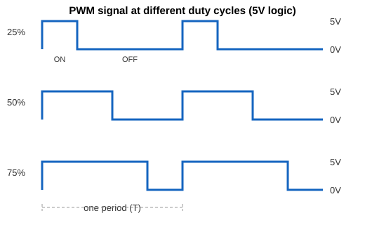
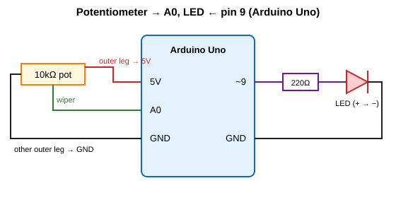

# PWM with Arduino: dimming an LED with a potentiometer

This little project uses a potentiometer to control the brightness of an LED. Along the way it covers how Arduino reads analog signals, why it can't really write them, and how pulse-width modulation (PWM) gets around that.

I wrote it for an Arduino Uno. Other boards will work too, but pin numbers, ADC resolution and PWM frequencies can differ.

## Starting with analog inputs

Most of what you connect to an Arduino falls into two camps. A button is digital: it's either pressed or it isn't, so the pin sees 5 V or 0 V. A knob, a light sensor or a temperature sensor is analog: the voltage can sit anywhere between 0 and 5 V.

The chip can't work with a smooth voltage directly, so the analog pins (A0 to A5 on the Uno) go through an analog-to-digital converter (ADC). On the Uno it's 10-bit, which means it splits the 0 to 5 V range into 1024 steps and gives you a number from 0 to 1023. Each step is about 4.9 mV. 0 V reads as 0, 2.5 V reads as roughly 512, and 5 V reads as 1023.

### How a potentiometer gives you a voltage

A potentiometer is a resistor with a sliding contact called the wiper. It has three pins. You connect one outer pin to 5 V, the other outer pin to GND, and take the middle pin (the wiper) to an analog input. As you turn the knob, the wiper moves along the resistor and the voltage on the middle pin slides smoothly from 0 V to 5 V. This setup is called a voltage divider.

### Try it: read the knob

Wire the wiper to A0 and upload this:

```cpp
void setup() {
  Serial.begin(9600);
}

void loop() {
  int value = analogRead(A0);            // 0 to 1023
  float volts = value * (5.0 / 1023.0);

  Serial.print(value);
  Serial.print("  ->  ");
  Serial.print(volts);
  Serial.println(" V");

  delay(200);
}
```

Open the Serial Monitor at 9600 baud and turn the knob. You should see the number climb from 0 to 1023 and the voltage go from 0 to 5 V. That's the input side done.

## The output problem

Reading a range of values is easy. Producing one is harder. On most Arduino pins you only have this:

```cpp
digitalWrite(pin, HIGH);  // 5 V
digitalWrite(pin, LOW);   // 0 V
```

There's nothing in between, and the Uno has no digital-to-analog converter (DAC). So how do you dim an LED or slow down a motor?

You could swap in a different resistor every time you want a different brightness, but that's not practical. You could add a DAC chip, but that's extra parts and wiring. You could use a variable resistor in series, but that just burns the extra power as heat. PWM avoids all of that and only needs a normal digital pin.

## What PWM actually is

The idea is simple. Instead of trying to output, say, 2.5 V, you switch the pin between 5 V and 0 V very quickly and control how much of the time it spends at 5 V. If it's on half the time and off half the time, the average is 2.5 V.



A few terms come up constantly:

- **Period** is the time for one full on-and-off cycle.
- **Frequency** is how many cycles happen per second (the inverse of the period). Most PWM pins on the Uno run at about 490 Hz, and pins 5 and 6 run at about 980 Hz.
- **Duty cycle** is the percentage of each period the signal spends high.

The average voltage a load sees is just the duty cycle times the supply voltage:

```
average voltage = duty cycle x 5 V
```

| Duty cycle | analogWrite value | Average voltage |
| ---------: | ----------------: | --------------: |
|         0% |                 0 |             0 V |
|        25% |                64 |    about 1.25 V |
|        50% |               127 |     about 2.5 V |
|        75% |               191 |    about 3.75 V |
|       100% |               255 |             5 V |

### A note on analogWrite()

The name is a bit misleading. `analogWrite(pin, value)` doesn't produce a real analog voltage. It starts PWM on that pin, where `value` runs from 0 to 255 and the duty cycle is `value / 255`. It only works on pins marked with a tilde (~). On the Uno those are 3, 5, 6, 9, 10 and 11.

## Why the LED looks dimmer

The LED really is flashing on and off around 490 times a second. LEDs respond in nanoseconds, so it isn't smoothing anything out. Your eyes are what do the averaging. Anything flickering faster than roughly 60 to 100 times a second just looks like steady light, so a 25% duty cycle looks like an LED at about a quarter brightness.

Motors work on a similar principle, except it's their inertia that smooths the pulses out. There's also an efficiency benefit. The pin is either fully on or fully off, so very little energy is wasted compared with a variable resistor.

## The project: potentiometer controlling an LED

### Wiring



- Pot outer pin to 5 V
- Pot other outer pin to GND
- Pot middle pin (wiper) to A0
- LED long leg (anode) to pin 9 through the 220 Ω resistor
- LED short leg (cathode) to GND

Don't skip the resistor. Without it the LED can burn out, and it can damage the pin too.

### Code

```cpp
// Potentiometer on A0 controls LED brightness on pin 9

const int potPin = A0;
const int ledPin = 9;   // must be a PWM pin (~)

void setup() {
  pinMode(ledPin, OUTPUT);
  Serial.begin(9600);
}

void loop() {
  int potValue = analogRead(potPin);                 // 0 to 1023
  int brightness = map(potValue, 0, 1023, 0, 255);   // scale to 0 to 255

  analogWrite(ledPin, brightness);

  Serial.print("Pot: ");
  Serial.print(potValue);
  Serial.print("  Brightness: ");
  Serial.println(brightness);

  delay(10);
}
```

Turn the knob and the LED should fade smoothly from off to full brightness.

### What's happening, step by step

1. Turning the knob moves the wiper, so the voltage on A0 changes between 0 and 5 V.
2. `analogRead()` converts that voltage into a number from 0 to 1023.
3. `map()` rescales it to 0 to 255, because that's the range `analogWrite()` expects. Dividing by 4 would do the same job.
4. `analogWrite()` uses that number to set the duty cycle on pin 9.
5. Pin 9 switches between 5 V and 0 V at about 490 Hz, spending more or less time high depending on the duty cycle.
6. Your eye averages the flicker, so the LED looks brighter or dimmer.

With the knob at the halfway point, `analogRead()` gives about 512, `map()` turns that into about 127, and the duty cycle is roughly 50%. The LED looks about half as bright.

## A peek under the hood

The ATmega328P on the Uno has three hardware timers that generate PWM on their own, so the CPU isn't tied up toggling pins. Timer0 handles pins 5 and 6, Timer1 handles 9 and 10, and Timer2 handles 3 and 11.

Roughly, a timer counts from 0 to 255 and starts over, again and again. When you call `analogWrite(pin, 100)`, the pin goes high at the start of the count and drops low when the counter reaches 100. That's why the duty cycle is `value / 255`. One thing to watch out for: Timer0 also drives `millis()` and `delay()`, so changing its settings will mess up your timing.

## Where else PWM shows up

- Dimming LEDs and mixing colours on RGB LEDs
- Controlling DC motor speed (through a transistor or motor driver, never straight from the pin)
- Driving servos, which use pulses of about 1 to 2 ms every 20 ms
- Making tones with a buzzer
- Switching power supplies and battery chargers
- Building a crude DAC, by passing PWM through a simple RC low-pass filter

## If something isn't working

- **LED never lights:** check the LED direction, the pin number and that GND is connected.
- **LED is always at full brightness:** the pin probably isn't a PWM pin, or you're using `digitalWrite()` instead of `analogWrite()`.
- **Readings jump around:** look for a loose wire, or a wiper that isn't actually connected to the analog pin.
- **Readings only ever show 0 or 1023:** one of the outer pot pins isn't connected to 5 V or GND.
- **Different numbers on another board:** ADC resolution varies. Boards like the Zero, Due and ESP32 have 12-bit ADCs, and their PWM pins and frequencies differ too.

## Things to try next

- Remove the pot and fade the LED automatically with a `for` loop (the built-in Fade example does this).
- Flip the direction of the knob with `map(potValue, 0, 1023, 255, 0)`.
- Try gamma correction. Eyes don't see brightness linearly, so something like `pow(potValue / 1023.0, 2.2) * 255` gives a more even-looking fade.
- Use three pots and an RGB LED to mix colours.
- Swap the LED for a transistor-driven motor.
- Put an oscilloscope or logic analyser on the PWM pin and watch the duty cycle change as you turn the knob.
- Read up on timer prescalers to change the PWM frequency.

## Further reading

Arduino documentation:

- [analogRead()](https://www.arduino.cc/reference/en/language/functions/analog-io/analogread/)
- [analogWrite()](https://www.arduino.cc/reference/en/language/functions/analog-io/analogwrite/)
- [map()](https://www.arduino.cc/reference/en/language/functions/math/map/)
- [Analog output and PWM tutorial](https://docs.arduino.cc/learn/microcontrollers/analog-output/)
- [Fade example](https://docs.arduino.cc/built-in-examples/basics/Fade/)
- [AnalogInOutSerial example](https://docs.arduino.cc/built-in-examples/analog/AnalogInOutSerial/)

Background:

- [Pulse-width modulation (Wikipedia)](https://en.wikipedia.org/wiki/Pulse-width_modulation)
- [Potentiometer (Wikipedia)](https://en.wikipedia.org/wiki/Potentiometer)
- [Voltage divider (Wikipedia)](https://en.wikipedia.org/wiki/Voltage_divider)
- [Analog-to-digital converter (Wikipedia)](https://en.wikipedia.org/wiki/Analog-to-digital_converter)
- [Flicker fusion threshold (Wikipedia)](https://en.wikipedia.org/wiki/Flicker_fusion_threshold)
- [ATmega328P datasheet (Microchip)](https://www.microchip.com/en-us/product/ATmega328P), see the timer and ADC chapters
- [PWM circuits on Wikimedia Commons](https://commons.wikimedia.org/wiki/Category:Pulse-width_modulation)
