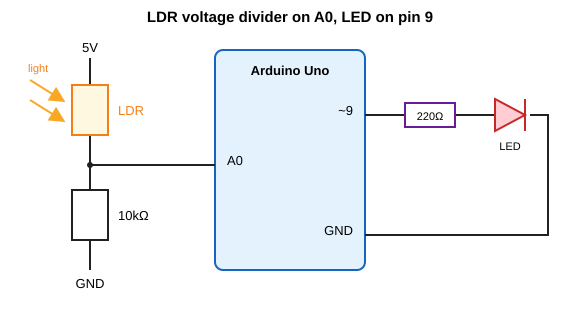
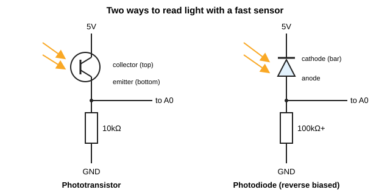

# Controlling an LED with light: photoresistors, photodiodes and phototransistors

This project uses light to control light. A sensor watches how bright the room is, and the Arduino adjusts an LED to match, for example a night light that fades up as it gets dark. We'll start with the photoresistor (the easiest sensor to use), build the night light, and then look at photodiodes and phototransistors, which do the same job faster and with a bit more wiring care.

It builds on analog input and PWM. If those are new to you, the short version is that `analogRead()` gives you a number from 0 to 1023 for a voltage between 0 and 5 V, and `analogWrite()` uses PWM to give an LED a brightness from 0 to 255. The examples are written for an Arduino Uno.

## What you need

- Arduino Uno and a USB cable
- A photoresistor (LDR), something like a GL5528 is common in kits
- A phototransistor and/or a photodiode if you want to try part two
- 10 kΩ resistor, plus a 100 kΩ or larger one for the photodiode
- One LED and a 220 Ω resistor for it
- Breadboard and jumper wires

## The photoresistor

A photoresistor, also called a light-dependent resistor or LDR, is a resistor whose value changes with light. In the dark its resistance is very high, and as light hits it the resistance drops. For a typical GL5528 that's roughly 10 to 20 kΩ at 10 lux and around 1 MΩ in complete darkness, but check the datasheet for your part because they vary quite a bit.

Inside there's a wavy track of cadmium sulfide. Light knocks electrons loose in the material, so more charge can flow and the resistance falls. It's a simple, cheap, robust part, and it responds to visible light in a way that's fairly similar to the human eye.

### Turning resistance into a voltage

The catch is that Arduino measures voltage, not resistance. The fix is a voltage divider, the same trick used with a potentiometer. Put the LDR in series with a fixed resistor and read the voltage at the point where they meet.



With the LDR between 5 V and A0, and a 10 kΩ resistor between A0 and GND, the voltage on A0 is:

```
Vout = 5 V x 10k / (R_ldr + 10k)
```

In bright light the LDR's resistance is small, so most of the 5 V shows up at A0 and you read a high number. In the dark the LDR's resistance is large, so A0 sits close to 0 V and you read a low number. If you swap the two parts around, the relationship flips.

The 10 kΩ value is a sensible starting point because it sits in the middle of the LDR's range. If your readings bunch up at one end, try a different fixed resistor.

### First step: watch the numbers

Wire up the divider and upload this:

```cpp
const int sensorPin = A0;

void setup() {
  Serial.begin(9600);
}

void loop() {
  int light = analogRead(sensorPin);   // 0 to 1023
  Serial.println(light);
  delay(200);
}
```

Open the Serial Monitor at 9600 baud. Cover the sensor with your hand, then shine a phone torch at it, and note what range you get. Those two numbers matter for the next step.

## Project: a night light

The goal is an LED that gets brighter as the room gets darker.

### Wiring

Use the divider from above, and add the LED:

- LDR between 5 V and A0
- 10 kΩ resistor between A0 and GND
- LED long leg (anode) to pin 9 through a 220 Ω resistor
- LED short leg (cathode) to GND

Pin 9 is a PWM pin, which is what lets us dim the LED instead of just switching it.

### Code

Every room and every LDR is a little different, so instead of guessing at the numbers this sketch calibrates itself. For the first five seconds after reset it records the darkest and brightest readings it sees, so cover and uncover the sensor during that time.

```cpp
// Night light: the darker it is, the brighter the LED

const int sensorPin = A0;
const int ledPin = 9;

int sensorMin = 1023;
int sensorMax = 0;

void setup() {
  pinMode(ledPin, OUTPUT);
  Serial.begin(9600);

  // Calibrate for 5 seconds: cover and uncover the sensor
  while (millis() < 5000) {
    int value = analogRead(sensorPin);
    if (value < sensorMin) sensorMin = value;
    if (value > sensorMax) sensorMax = value;
  }
}

int readSmoothed() {
  long total = 0;
  for (int i = 0; i < 10; i++) {
    total += analogRead(sensorPin);
    delay(2);
  }
  return total / 10;
}

void loop() {
  int light = readSmoothed();

  // Bright room -> low brightness, dark room -> high brightness
  int brightness = map(light, sensorMin, sensorMax, 255, 0);
  brightness = constrain(brightness, 0, 255);

  analogWrite(ledPin, brightness);

  Serial.print("Light: ");
  Serial.print(light);
  Serial.print("  LED: ");
  Serial.println(brightness);

  delay(20);
}
```

A few things are going on here that are worth understanding:

- `map()` rescales the sensor range to the LED range. The output range is written backwards (255 to 0) on purpose, which is what flips bright-in-dark-out.
- `constrain()` keeps the result between 0 and 255. Without it, a reading outside the calibrated range would give a value `analogWrite()` can't use properly.
- `readSmoothed()` averages ten readings. Analog readings jitter a little, and averaging stops the LED from shimmering.

One practical gotcha: keep the LED from shining directly on the sensor. If it does, the light output changes the reading, which changes the light output, and you get an odd feedback loop where the LED hunts around. Point the sensor away from the LED or shade it.

### A simple on/off version

If you just want the LED to switch on when it gets dark, you can use a threshold. The trap here is flicker: if the room brightness sits right around your threshold, the LED will rapidly toggle. The fix is hysteresis, meaning you use two thresholds instead of one.

```cpp
const int sensorPin = A0;
const int ledPin = 9;

const int turnOnBelow = 300;    // switch on when darker than this
const int turnOffAbove = 400;   // switch off when brighter than this

bool ledOn = false;

void setup() {
  pinMode(ledPin, OUTPUT);
}

void loop() {
  int light = analogRead(sensorPin);

  if (!ledOn && light < turnOnBelow) {
    ledOn = true;
  } else if (ledOn && light > turnOffAbove) {
    ledOn = false;
  }

  digitalWrite(ledPin, ledOn ? HIGH : LOW);
  delay(50);
}
```

Adjust the two numbers to fit the readings you saw in the Serial Monitor earlier. The gap between them is what stops the flicker.

## Photodiodes and phototransistors

LDRs are great for slow, gentle changes like day and night, but they're sluggish. Their resistance takes tens of milliseconds to react and it lags even more when going from bright back to dark. That's no use if you want to detect a flashing light, read a remote control signal or measure something quickly. For that, use a photodiode or a phototransistor.

### Photodiode

A photodiode is a diode that lets a small current flow when light hits it. The current is roughly proportional to the amount of light, and it reacts in microseconds or faster. For Arduino use you connect it reverse biased, with the cathode (the side marked with a bar in the symbol) toward the positive supply and the anode toward the measuring point.

The current is tiny, often just microamps in normal room light, so a big resistor is needed to turn it into a voltage you can read. Ohm's law does the work: 10 µA through 100 kΩ gives 1 V. The bigger the resistor, the bigger the signal, but the slower and noisier the circuit gets. If you need a strong, clean signal from a photodiode, the proper solution is an op-amp transimpedance amplifier, but for a simple project a 100 kΩ to 1 MΩ resistor is a good place to start.

### Phototransistor

A phototransistor is a transistor where light plays the role of the base current. The photocurrent gets amplified by the transistor, so you get a much bigger signal than with a photodiode of similar size, at the cost of being a bit slower (still microseconds, far faster than an LDR) and less linear.

The easy way to wire the usual two-pin type is with the collector to 5 V and the emitter to your analog pin, with a resistor from the emitter to GND. More light means more current, which means a higher voltage across the resistor. The longer leg is normally the collector, but check the datasheet, and a flat side on the case usually marks the emitter.



### The code doesn't change

Both circuits are wired so that more light gives a higher reading, exactly like the LDR divider. That means the same sketches work as they are. Swap the sensor, run the Serial Monitor sketch again to see what range you get, and let the calibration code sort out the rest.

What you may need to change is the resistor:

- If the reading is pegged near 1023 in normal room light, the resistor is too large. Use a smaller one.
- If it barely moves off 0, the resistor is too small. Use a larger one.

Also check what wavelengths your part responds to. Many clear 5 mm phototransistors and photodiodes are tuned for infrared, and IR parts often come in a dark plastic case. They'll still react to visible light, just differently from your eyes. If you specifically want something that behaves like a light meter, look for an ambient light phototransistor such as the TEPT4400.

## Which one should you use?

| | LDR | Photodiode | Phototransistor |
|---|---|---|---|
| Speed | Slow (tens of ms) | Very fast | Fast |
| Signal size | Large | Very small | Medium to large |
| Extra parts | One resistor | Big resistor, maybe an amplifier | One resistor |
| Best for | Day/night, ambient light | Fast pulses, accurate measurement | Fast detection, simple wiring |

For a night light, an LDR is perfectly fine and the simplest option. If you're detecting flashes, pulses or an IR signal, reach for a photodiode or phototransistor.

## If something isn't working

- **LED never changes:** check the numbers in the Serial Monitor first. If those don't change either, the problem is in the sensor circuit, not the LED.
- **Readings don't move:** the sensor may not be connected to the point where the two parts meet, or the fixed resistor is a poor match.
- **LED is backwards (bright in the light):** the map range is the wrong way round, or the divider has the parts swapped. Flip the 255 and 0 in `map()`.
- **LED flickers or hunts:** the LED is lighting the sensor, or the reading hovers around a threshold. Shade the sensor, add averaging, or use hysteresis.
- **Reading stuck at 0 or 1023:** the fixed resistor is the wrong size for your sensor and light level.
- **LED doesn't dim, only on or off:** you're probably not on a PWM pin. On the Uno use 3, 5, 6, 9, 10 or 11.

## Things to try next

- Add a second LED and make it turn on only when it's very dark.
- Try a different fixed resistor and see how it changes the range you get from the LDR.
- Use a phototransistor and point a TV remote at it. Print the readings quickly and you'll see the IR pulses flicker.
- Flash one LED at a fixed rate and use a photodiode to detect it, then count the flashes.
- Build a simple light meter that shows brightness as a bar of LEDs.
- Put a sensor in a small tube to make it directional so it only responds to what you point it at.

## Further reading

Arduino documentation:

- [analogRead()](https://www.arduino.cc/reference/en/language/functions/analog-io/analogread/)
- [analogWrite()](https://www.arduino.cc/reference/en/language/functions/analog-io/analogwrite/)
- [map()](https://www.arduino.cc/reference/en/language/functions/math/map/)
- [constrain()](https://www.arduino.cc/reference/en/language/functions/math/constrain/)
- [Calibration example](https://docs.arduino.cc/built-in-examples/sensors/Calibration/)

Background:

- [Photoresistor (Wikipedia)](https://en.wikipedia.org/wiki/Photoresistor)
- [Photodiode (Wikipedia)](https://en.wikipedia.org/wiki/Photodiode)
- [Phototransistor (Wikipedia)](https://en.wikipedia.org/wiki/Phototransistor)
- [Voltage divider (Wikipedia)](https://en.wikipedia.org/wiki/Voltage_divider)
- [Hysteresis (Wikipedia)](https://en.wikipedia.org/wiki/Hysteresis)
- [Adafruit: Photocells tutorial](https://learn.adafruit.com/photocells)
