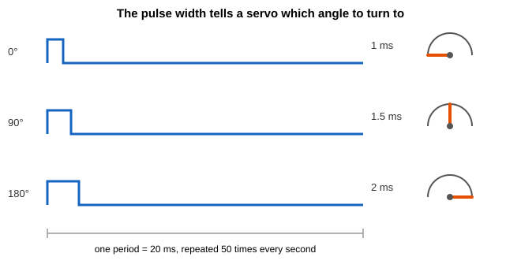
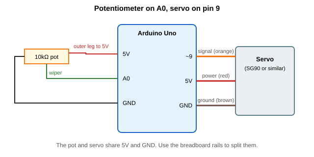
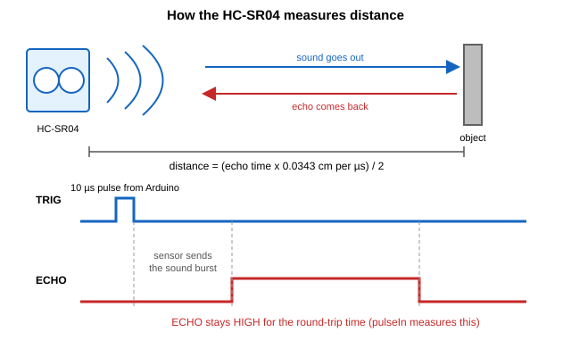
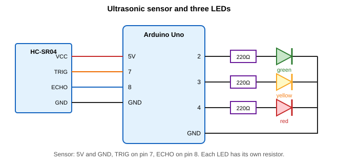
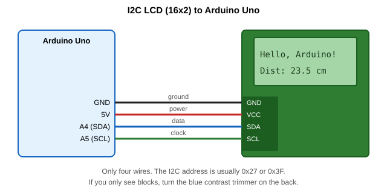
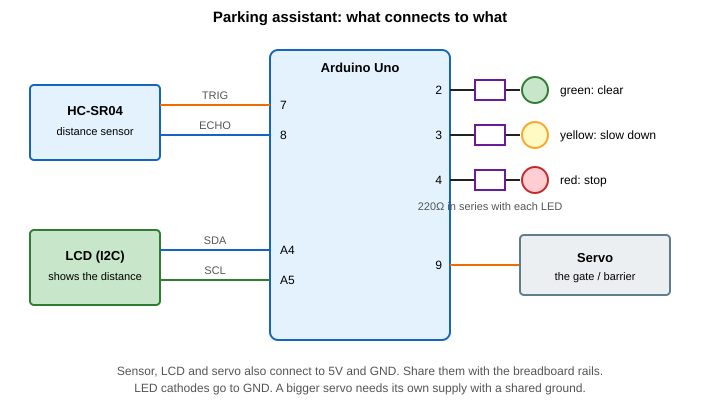

# Servos, ultrasonic sensors and LCDs

In this guide you'll add three new parts to your toolbox: a **servo motor** that turns to an exact angle, an **ultrasonic sensor** that measures distance, and an **LCD** that shows text without needing the Serial Monitor.
The code is written for an Arduino Uno.

## What you need

- Arduino Uno and a USB cable
- Breadboard and jumper wires
- A small hobby servo (an SG90 or similar)
- An HC-SR04 ultrasonic sensor
- A 16x2 LCD with an I2C backpack (four pins: GND, VCC, SDA, SCL)
- 10 kΩ potentiometer
- Red, yellow and green LEDs with three 220 Ω resistors
- A ruler or tape measure (you'll need it to test the distance sensor)

---

## Part 1: Servo motors

### What's a servo?

A normal DC motor spins when you give it power, and you have no idea where the shaft is pointing. A servo is different. Inside the case are a small motor, a gearbox, a sensor that tracks the shaft position, and a control circuit. You tell it an angle, and it turns there and holds. A hobby servo usually turns through about 180 degrees.

That makes servos good for anything that needs to point or move to a position: a robot arm, a steering mechanism, a gate, a pointer on a dial.

### How you tell it where to go

You send the servo a pulse every 20 ms (50 times a second). The **width of the pulse** sets the angle.



- 1 ms pulse: turn to 0 degrees
- 1.5 ms pulse: turn to 90 degrees
- 2 ms pulse: turn to 180 degrees

If this reminds you of PWM, it should. It's the same idea of a repeating pulse where the on-time carries the information. With PWM for LEDs, the _average_ of the pulse mattered. With a servo, the _exact width_ of one pulse matters.

You don't have to generate those pulses yourself. The `Servo` library does it for you.

### Wiring

A servo has three wires:

| Wire colour      | Job                        |
| ---------------- | -------------------------- |
| Brown or black   | Ground (GND)               |
| Red              | Power (5 V)                |
| Orange or yellow | Signal (to an Arduino pin) |

**A word about power.** A small SG90 can safely run from the Arduino's 5 V pin for light testing. But a servo draws a lot of current when it starts moving or pushes against something, and a larger servo can pull hundreds of milliamps. That can make the Arduino reset or behave strangely. If you see that, power the servo from a separate 5 V supply (such as four AA batteries) and connect its ground to the Arduino's ground so they share a reference.

### Servo sweep example

```cpp
#include <Servo.h>

Servo myServo;

void setup() {
  myServo.attach(9);          // signal wire is on pin 9
}

void loop() {
  for (int angle = 0; angle <= 180; angle++) {
    myServo.write(angle);
    delay(15);
  }
  for (int angle = 180; angle >= 0; angle--) {
    myServo.write(angle);
    delay(15);
  }
}
```

### Servo control with a potentiometer

You already know how to turn a pot into a number. Now you'll turn that number into an angle.



Add the potentiometer. The outer legs go to 5 V and GND, and the middle leg (the wiper) goes to A0. The servo stays on pin 9.

```cpp
#include <Servo.h>

Servo myServo;
const int potPin = A0;

void setup() {
  myServo.attach(9);
  Serial.begin(9600);
}

void loop() {
  int potValue = analogRead(potPin);              // 0 to 1023
  int angle = map(potValue, 0, 1023, 0, 180);     // scale to 0 to 180

  myServo.write(angle);

  Serial.print("Pot: ");
  Serial.print(potValue);
  Serial.print("  Angle: ");
  Serial.println(angle);

  delay(15);
}
```

It's the same pattern as the LED dimmer: **read a knob, scale the number, send it to an output**. The only differences are the output range (0 to 180 instead of 0 to 255) and the output device.

### Servo troubleshooting

- **The servo jitters or buzzes:** the reading is noisy, or the power is weak. Try a separate supply, and add a 100 µF capacitor across the servo's power and ground.
- **The Arduino resets when the servo moves:** the servo is drawing too much current. Use a separate supply.
- **The servo grinds at the ends:** it's trying to go past its limit. Restrict the range, for example `map(potValue, 0, 1023, 10, 170)`.
- **It doesn't move at all:** check the signal wire is on pin 9, and that ground is shared.
- **PWM on pins 9 and 10 stopped working:** on the Uno, the Servo library takes over the timer used by those two pins, so `analogWrite()` won't work there while it's in use.

---

## Part 2: Ultrasonic distance sensor

### How it works

The HC-SR04 works like a bat or a ship's sonar. It sends out a short burst of sound at 40 kHz, which is too high for us to hear. The sound hits an object and bounces back, and the sensor listens for the echo. The longer the echo takes, the further away the object is.



The Arduino drives this with two pins:

1. **TRIG:** the Arduino sends a 10 µs pulse here to say "measure now".
2. **ECHO:** the sensor makes this pin go HIGH when it sends the burst, and LOW when the echo returns. The time it stays HIGH is the round trip.

### The maths

Sound travels at about 343 metres per second at room temperature. That's 0.0343 centimetres per microsecond. The sound has to go _there and back_, so you halve the time:

```
distance (cm) = echo time (µs) x 0.0343 / 2
```

### Wiring



- VCC to 5 V, GND to GND
- TRIG to pin 7, ECHO to pin 8
- Green, yellow and red LEDs to pins 2, 3 and 4, each through its own 220 Ω resistor to GND

Don't add the LEDs yet if you want to test the sensor first.

### Measure and print the distance

```cpp
const int trigPin = 7;
const int echoPin = 8;

void setup() {
  pinMode(trigPin, OUTPUT);
  pinMode(echoPin, INPUT);
  Serial.begin(9600);
}

void loop() {
  // Send a 10 microsecond pulse
  digitalWrite(trigPin, LOW);
  delayMicroseconds(2);
  digitalWrite(trigPin, HIGH);
  delayMicroseconds(10);
  digitalWrite(trigPin, LOW);

  // Measure how long ECHO stays HIGH (give up after 30 ms)
  long duration = pulseIn(echoPin, HIGH, 30000);

  if (duration == 0) {
    Serial.println("No echo");
  } else {
    float distance = duration * 0.0343 / 2;
    Serial.print(distance);
    Serial.println(" cm");
  }

  delay(100);
}
```

A few things worth noticing:

- `pulseIn()` waits for the pin to go HIGH, then times how long it stays HIGH. The `30000` is a timeout in microseconds. Without it, the program would wait a long time if no echo came back.
- `pulseIn()` returns 0 on a timeout, so we check for that rather than printing a nonsense distance.
- The delay at the end gives old echoes time to die away before the next measurement.

### Parking sensor with LEDs

Now add the LEDs, so the colour tells you how close something is.

```cpp
const int trigPin = 7;
const int echoPin = 8;
const int greenPin = 2;
const int yellowPin = 3;
const int redPin = 4;

void setup() {
  pinMode(trigPin, OUTPUT);
  pinMode(echoPin, INPUT);
  pinMode(greenPin, OUTPUT);
  pinMode(yellowPin, OUTPUT);
  pinMode(redPin, OUTPUT);
  Serial.begin(9600);
}

void loop() {
  digitalWrite(trigPin, LOW);
  delayMicroseconds(2);
  digitalWrite(trigPin, HIGH);
  delayMicroseconds(10);
  digitalWrite(trigPin, LOW);

  long duration = pulseIn(echoPin, HIGH, 30000);
  float distance = duration * 0.0343 / 2;

  // Turn everything off, then light the right one
  digitalWrite(greenPin, LOW);
  digitalWrite(yellowPin, LOW);
  digitalWrite(redPin, LOW);

  if (duration == 0 || distance > 30) {
    digitalWrite(greenPin, HIGH);      // clear
  } else if (distance > 10) {
    digitalWrite(yellowPin, HIGH);     // getting close
  } else {
    digitalWrite(redPin, HIGH);        // stop
  }

  Serial.println(distance);
  delay(100);
}
```

---

## Part 3: The LCD display

### Why an LCD?

The Serial Monitor needs a computer. An LCD lets your project show information on its own: a distance, a temperature, a message. The common 16x2 type has two rows of 16 characters.

### I2C in a minute

A bare LCD needs about six data pins, which uses up a lot of your Arduino. A cheap backpack board on the back of the LCD fixes this by using **I2C**, a communication method that needs only two signal wires:

- **SDA:** the data line
- **SCL:** the clock line

Many devices can share the same two wires, because each one has its own address. The LCD usually has an address of `0x27` or `0x3F`. On the Uno, SDA is pin A4 and SCL is pin A5.

### Wiring



Four wires: GND to GND, VCC to 5 V, SDA to A4, SCL to A5.

### Install the library

1. In the IDE, open **Sketch > Include Library > Manage Libraries**.
2. Search for **LiquidCrystal I2C**.
3. Install the one by Frank de Brabander.

### Find the address

Before you write to the screen, check its address. This sketch scans the I2C bus and prints whatever it finds.

```cpp
#include <Wire.h>

void setup() {
  Serial.begin(9600);
  Wire.begin();
  Serial.println("Scanning...");

  for (byte address = 1; address < 127; address++) {
    Wire.beginTransmission(address);
    if (Wire.endTransmission() == 0) {
      Serial.print("Found a device at 0x");
      Serial.println(address, HEX);
    }
  }
  Serial.println("Done");
}

void loop() {
}
```

Open the Serial Monitor. If it prints `0x27` (or `0x3F`), use that number in the next sketch. If it finds nothing, check the wiring, especially SDA and SCL.

### Hello, LCD

```cpp
#include <Wire.h>
#include <LiquidCrystal_I2C.h>

LiquidCrystal_I2C lcd(0x27, 16, 2);   // address, columns, rows

void setup() {
  lcd.init();
  lcd.backlight();

  lcd.setCursor(0, 0);          // column 0, row 0
  lcd.print("Hello, Arduino!");

  lcd.setCursor(0, 1);          // column 0, row 1
  lcd.print("Line two");
}

void loop() {
}
```

If you see only solid blocks, or nothing at all, turn the small blue trimmer on the back of the backpack with a screwdriver. It adjusts the contrast.

The commands you need are few:

| Command                   | What it does                                       |
| ------------------------- | -------------------------------------------------- |
| `lcd.init()`              | Starts the display                                 |
| `lcd.backlight()`         | Turns the backlight on (`noBacklight()` for off)   |
| `lcd.setCursor(col, row)` | Moves to a position (columns 0 to 15, rows 0 to 1) |
| `lcd.print(x)`            | Prints text or a number at the cursor              |
| `lcd.clear()`             | Wipes the screen                                   |

Some library versions use `lcd.begin()` instead of `lcd.init()`. If one doesn't compile, try the other.

### Show the potentiometer on the LCD

Reuse the pot on A0. This sketch shows the pot value and a percentage.

```cpp
#include <Wire.h>
#include <LiquidCrystal_I2C.h>

LiquidCrystal_I2C lcd(0x27, 16, 2);
const int potPin = A0;

void setup() {
  lcd.init();
  lcd.backlight();
}

void loop() {
  int potValue = analogRead(potPin);
  int percent = map(potValue, 0, 1023, 0, 100);

  lcd.setCursor(0, 0);
  lcd.print("Value: ");
  lcd.print(potValue);
  lcd.print("    ");            // spaces wipe leftover digits

  lcd.setCursor(0, 1);
  lcd.print("Percent: ");
  lcd.print(percent);
  lcd.print("%   ");

  delay(100);
}
```

### LCD troubleshooting

- **Backlight on but no text, or solid blocks:** adjust the contrast trimmer.
- **Nothing at all:** check the address with the scanner, and check SDA and SCL aren't swapped.
- **Garbage characters:** try the other library function (`init` or `begin`), or reinstall the library.
- **Text is cut off:** lines are only 16 characters. Shorten your text.

---

## Project: Parking assistant

Time to combine all three. A distance sensor watches for an object, the LCD shows the distance, the LEDs show green, yellow or red, and a servo lifts a gate when something comes within 20 cm.



### Pin plan

| Part                    | Connection                                         |
| ----------------------- | -------------------------------------------------- |
| HC-SR04                 | TRIG on 7, ECHO on 8, plus 5 V and GND             |
| LCD (I2C)               | SDA on A4, SCL on A5, plus 5 V and GND             |
| Green, yellow, red LEDs | Pins 2, 3, 4, each through a 220 Ω resistor to GND |
| Servo                   | Signal on pin 9, plus 5 V and GND                  |

### Code

```cpp
#include <Wire.h>
#include <LiquidCrystal_I2C.h>
#include <Servo.h>

const int trigPin = 7;
const int echoPin = 8;
const int greenPin = 2;
const int yellowPin = 3;
const int redPin = 4;
const int servoPin = 9;

LiquidCrystal_I2C lcd(0x27, 16, 2);
Servo gate;
bool gateOpen = false;

// Returns the distance in cm, or -1 if there was no echo
float readDistance() {
  digitalWrite(trigPin, LOW);
  delayMicroseconds(2);
  digitalWrite(trigPin, HIGH);
  delayMicroseconds(10);
  digitalWrite(trigPin, LOW);

  long duration = pulseIn(echoPin, HIGH, 30000);
  if (duration == 0) {
    return -1;
  }
  return duration * 0.0343 / 2;
}

void setup() {
  pinMode(trigPin, OUTPUT);
  pinMode(echoPin, INPUT);
  pinMode(greenPin, OUTPUT);
  pinMode(yellowPin, OUTPUT);
  pinMode(redPin, OUTPUT);

  gate.attach(servoPin);
  gate.write(0);                 // gate starts closed

  lcd.init();
  lcd.backlight();
  lcd.setCursor(0, 0);
  lcd.print("Parking assist");
  delay(1500);
  lcd.clear();
}

void loop() {
  float distance = readDistance();
  bool nothing = (distance < 0);      // no echo means nothing in range

  digitalWrite(greenPin, LOW);
  digitalWrite(yellowPin, LOW);
  digitalWrite(redPin, LOW);

  // Top row: the distance
  lcd.setCursor(0, 0);
  lcd.print("Dist: ");
  if (nothing) {
    lcd.print("---       ");
  } else {
    lcd.print(distance, 1);
    lcd.print(" cm   ");
  }

  // Bottom row and LEDs: the status
  lcd.setCursor(0, 1);
  if (nothing || distance > 30) {
    digitalWrite(greenPin, HIGH);
    lcd.print("Clear           ");
  } else if (distance > 10) {
    digitalWrite(yellowPin, HIGH);
    lcd.print("Slow down       ");
  } else {
    digitalWrite(redPin, HIGH);
    lcd.print("STOP            ");
  }

  // Gate: open when something is within 20 cm
  if (!nothing && distance < 20 && !gateOpen) {
    gate.write(90);
    gateOpen = true;
  } else if ((nothing || distance >= 20) && gateOpen) {
    gate.write(0);
    gateOpen = false;
  }

  delay(100);
}
```

### How it works

- `readDistance()` wraps the ultrasonic code in a **function**, so the main loop stays short and readable. It returns -1 when there's no echo.
- The LEDs and LCD status line use the same `if / else if / else` chain, so they always agree.
- `gateOpen` remembers the gate's state. The servo is only told to move when the state _changes_. Without this, `gate.write()` would be called every loop, and the servo would jitter.
- The padded text (`"Clear           "`) clears old characters on the LCD, just as in the potentiometer LCD example.

---

## If something isn't working

- **Everything resets at random:** the servo is pulling too much current. Use a separate supply.
- **The LCD works alone but not in the project:** make sure you used a different pin for each part. A4 and A5 are the LCD's, and pins 7 to 9 are taken by the sensor and servo.
- **Distance readings jump around:** hold the object still and flat, and keep the sensor clear of cables and edges.
- **The servo moves strangely when the LEDs change:** that's again a power problem. Test with the servo on its own supply.

## Where to go next

You've now hit the limit of `delay()`. In the parking assistant, the whole program freezes for 100 ms every loop, and the gate hold-off challenge is nearly impossible without a different approach. The next thing to learn is **`millis()`**, which lets the Arduino keep time while it does other things. After that, try a digital temperature sensor with the LCD (a DHT22 or BME280), or a DC motor with a motor driver.

## Further reading

Arduino documentation:

- [Servo library](https://www.arduino.cc/reference/en/libraries/servo/)
- [Servo motors tutorial](https://docs.arduino.cc/learn/electronics/servo-motors/)
- [pulseIn()](https://www.arduino.cc/reference/en/language/functions/advanced-io/pulsein/)
- [delayMicroseconds()](https://www.arduino.cc/reference/en/language/functions/time/delaymicroseconds/)
- [Wire library (I2C)](https://www.arduino.cc/reference/en/language/functions/communication/wire/)

Datasheets and libraries:

- [HC-SR04 datasheet](https://cdn.sparkfun.com/datasheets/Sensors/Proximity/HCSR04.pdf)
- [LiquidCrystal_I2C library](https://github.com/fdebrabander/Arduino-LiquidCrystal-I2C-library)

Background:

- [Servo (radio control) (Wikipedia)](<https://en.wikipedia.org/wiki/Servo_(radio_control)>)
- [Sonar (Wikipedia)](https://en.wikipedia.org/wiki/Sonar)
- [Speed of sound (Wikipedia)](https://en.wikipedia.org/wiki/Speed_of_sound)
- [I2C (Wikipedia)](https://en.wikipedia.org/wiki/I%C2%B2C)
