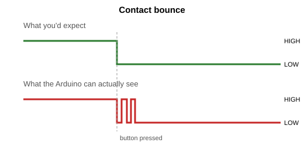
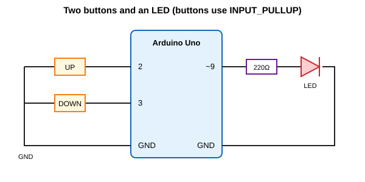

# Arduino Buttons and Digital Inputs

## Learning progression

Start with the input itself, observe its value in the Serial Monitor, and then use that value to control an output.

### Step 1: Read the button

For this first example, connect a roughly 10 kΩ resistor between pin 2 and the board's logic voltage (typically 5 V or 3.3 V). Connect the button between pin 2 and `GND`. The external resistor keeps the input stable while the button is released.

```cpp
const int buttonPin = 2;

void setup() {
	pinMode(buttonPin, INPUT);
	Serial.begin(9600);
}

void loop() {
	int buttonState = digitalRead(buttonPin);
	Serial.println(buttonState);
	delay(100);
}
```

Students should observe these readings in the Serial Monitor:

| Button   | Reading      |
| -------- | ------------ |
| Released | `1` (`HIGH`) |
| Pressed  | `0` (`LOW`)  |

### Step 2: Print a useful button state

Replace the numeric reading with a message students can interpret:

```cpp
const int buttonPin = 2;

void setup() {
	pinMode(buttonPin, INPUT);
	Serial.begin(9600);
}

void loop() {
	int buttonState = digitalRead(buttonPin);
	if (buttonState == LOW) {
		Serial.println("Button Pressed");
	} else {
		Serial.println("Button Released");
	}

	delay(100);
}
```

### Step 3: Understand `HIGH`, `LOW`, and active LOW

With this external pull-up circuit and `INPUT`, the input is `HIGH` when the button is released and `LOW` when it is pressed. This is called **active LOW**: the pressed state is represented by `LOW`.

### Step 4: Use the button to control an LED

Connect an LED and a suitable current-limiting resistor to pin 8, or use an onboard LED if available.

```cpp
const int buttonPin = 2;
const int ledPin = 8;

void setup() {
	pinMode(buttonPin, INPUT);
	pinMode(ledPin, OUTPUT);
}

void loop() {
	int buttonState = digitalRead(buttonPin);

	if (buttonState == LOW) {
		digitalWrite(ledPin, HIGH);
	} else {
		digitalWrite(ledPin, LOW);
	}
}
```

The signal path is:

```text
BUTTON -> digitalRead() -> HIGH / LOW -> if statement -> digitalWrite() -> LED
```

### Step 5: Compare pull-up and pull-down inputs

A pull-up holds the input at `HIGH` while the button is released. In this lesson, use an external roughly 10 kΩ resistor from the input pin to the board's logic voltage, and wire the button between the input pin and `GND`. Set the pin mode to `INPUT`.

| Configuration | Button released | Button pressed |
| ------------- | --------------- | -------------- |
| Pull-up       | `HIGH`          | `LOW`          |
| Pull-down     | `LOW`           | `HIGH`         |

A pull-down holds the input at `LOW` while the button is released. For comparison, use a roughly 10 kΩ resistor from the input pin to `GND`, and wire the button between the input and the board's supported logic voltage (typically 5 V or 3.3 V). Do not exceed the board's input voltage rating. Most classic Uno-style boards do not provide an internal pull-down option.

Button contacts can bounce and create multiple quick readings. The delays in the Serial examples limit output speed but are not full debouncing; add debounce logic when each press must register exactly once.

### Step 6: Challenge

Modify the LED program so the LED blinks while the button is held down and stays off when the button is released. Test it, then explain why the pressed check uses `LOW`.

### References

1. https://www.circuitbasics.com/pull-up-and-pull-down-resistors/
2. https://docs.arduino.cc/tutorials/generic/digital-input-pullup/

# Button projects to try next

This is an add-on to the Buttons and Digital Inputs lesson. By now you can read a button, print its state and switch an LED on while it's held down. The projects below take those same pieces and push them a bit further. They're roughly in order of difficulty, so start at the top and work down.

Everything here follows the same conventions as the lesson: the button goes on pin 2, the LED on pin 8 (or pin 9 when we need PWM), and pressed means `LOW`. The examples are written for an Arduino Uno.

## What you need

- Arduino Uno and a USB cable
- Two push buttons (one is enough for the first three projects)
- One LED and a 220 Ω resistor
- Breadboard and jumper wires

## One small change first: INPUT_PULLUP

In the lesson you wired a 10 kΩ resistor from the pin to 5 V so the input stays `HIGH` when the button is released. It turns out the Arduino has one of those resistors built in on every digital pin. You switch it on like this:

```cpp
pinMode(buttonPin, INPUT_PULLUP);
```

Now the wiring gets simpler. Connect the button between the pin and GND, and leave the external resistor out. Everything else behaves exactly as before: `HIGH` when released, `LOW` when pressed, still active LOW. The projects below all use `INPUT_PULLUP`. If you'd rather keep your external resistor, it does no harm, and you can use plain `INPUT` instead.

## Project 1: A toggle switch

**Goal:** press the button once and the LED turns on, press it again and it turns off. It stays in that state when you let go.

The trick is that you're no longer interested in whether the button is pressed right now. You care about the moment it changes from released to pressed. That's called state change detection.

There's a catch, though. A real button doesn't switch cleanly. For a few milliseconds when the contacts meet, they bounce and the pin flickers between `HIGH` and `LOW`.



You can't see that when you're holding a button and watching an LED, but the Arduino runs fast enough to catch every flicker. A single press could look like five, and your toggle would flip back and forth at random. The fix is debouncing: ignore changes until the reading has been stable for a short time.

```cpp
const int buttonPin = 2;
const int ledPin = 8;

int ledState = LOW;
int buttonState = HIGH;          // the debounced, "trusted" state
int lastReading = HIGH;          // the raw reading from last time round
unsigned long lastChange = 0;
const unsigned long debounceMs = 30;

void setup() {
  pinMode(buttonPin, INPUT_PULLUP);
  pinMode(ledPin, OUTPUT);
}

void loop() {
  int reading = digitalRead(buttonPin);

  // Any change restarts the timer
  if (reading != lastReading) {
    lastChange = millis();
  }

  // If the reading has held steady long enough, trust it
  if (millis() - lastChange > debounceMs) {
    if (reading != buttonState) {
      buttonState = reading;

      // Only act on the press, not the release
      if (buttonState == LOW) {
        ledState = !ledState;
        digitalWrite(ledPin, ledState);
      }
    }
  }

  lastReading = reading;
}
```

Try removing the debounce check and see how often the toggle misbehaves. Some buttons are cleaner than others, so you may need a few presses to catch it.

## Project 2: Press counter

**Goal:** count how many times the button has been pressed and print the total to the Serial Monitor. Then light the LED on every fifth press.

This uses the same idea as the toggle: act on the moment of pressing, not the state.

```cpp
const int buttonPin = 2;
const int ledPin = 8;

int count = 0;
int lastState = HIGH;

void setup() {
  pinMode(buttonPin, INPUT_PULLUP);
  pinMode(ledPin, OUTPUT);
  Serial.begin(9600);
}

void loop() {
  int state = digitalRead(buttonPin);

  // Was released last time, pressed now
  if (lastState == HIGH && state == LOW) {
    count++;
    Serial.print("Presses: ");
    Serial.println(count);

    digitalWrite(ledPin, count % 5 == 0 ? HIGH : LOW);

    delay(20);   // crude debounce
  }

  lastState = state;
}
```

The `delay(20)` is a quick and dirty debounce. It works fine for a counter, but it also freezes the whole program for 20 ms, which is why Project 1 uses a timer-based approach instead. Once you're comfortable with both, try swapping the delay for the millis() method.

**Try it:** change the sketch so the count resets to zero after ten presses, or so that it counts down instead of up.

## Project 3: Two-button dimmer

**Goal:** one button makes the LED brighter, the other makes it dimmer. Hold a button down and the brightness keeps changing.

This is where digital inputs meet PWM. The buttons are digital, but the LED gets an analog-style brightness from `analogWrite()`, so the LED has to go on a PWM pin. Pin 9 works well.



- "UP" button between pin 2 and GND
- "DOWN" button between pin 3 and GND
- LED long leg to pin 9 through a 220 Ω resistor, short leg to GND

```cpp
const int upPin = 2;
const int downPin = 3;
const int ledPin = 9;

int brightness = 0;

void setup() {
  pinMode(upPin, INPUT_PULLUP);
  pinMode(downPin, INPUT_PULLUP);
  pinMode(ledPin, OUTPUT);
  Serial.begin(9600);
}

void loop() {
  if (digitalRead(upPin) == LOW) {
    brightness += 5;
  }
  if (digitalRead(downPin) == LOW) {
    brightness -= 5;
  }

  brightness = constrain(brightness, 0, 255);
  analogWrite(ledPin, brightness);

  Serial.println(brightness);
  delay(30);
}
```

Holding a button repeats the change every 30 ms, so it takes about a second and a half to go from off to full brightness. Change the step size or the delay to make it faster or slower.

Notice that there's no state change detection here. That's intentional. For a dimmer we want the action to repeat while the button is held, and bounce doesn't matter because a few extra steps of 5 are invisible.

**Try it:** make the LED start at half brightness, or add a third button that jumps straight to off.

## Project 4: Reaction timer

**Goal:** the LED lights up after a random wait, and you press the button as fast as you can. The Arduino prints how many milliseconds you took.

This one uses `millis()`, which returns the number of milliseconds since the board powered on. Note down the time when the LED comes on, note it again when the button is pressed, and subtract.

```cpp
const int buttonPin = 2;
const int ledPin = 8;

void setup() {
  pinMode(buttonPin, INPUT_PULLUP);
  pinMode(ledPin, OUTPUT);
  Serial.begin(9600);
  randomSeed(analogRead(A0));   // floating pin gives a different seed each time
  Serial.println("Press the button as soon as the LED lights up.");
}

void loop() {
  digitalWrite(ledPin, LOW);
  delay(random(2000, 5000));    // wait 2 to 5 seconds

  digitalWrite(ledPin, HIGH);
  unsigned long start = millis();

  while (digitalRead(buttonPin) == HIGH) {
    // wait for the press
  }

  unsigned long reaction = millis() - start;
  digitalWrite(ledPin, LOW);

  Serial.print("Reaction time: ");
  Serial.print(reaction);
  Serial.println(" ms");

  delay(2000);
}
```

Most people land somewhere between 200 and 350 ms.

Two things are worth thinking about. What happens if you hold the button down before the LED comes on? (You'll get a time of 0, which is cheating.) And how would you stop that from working? A good approach is to check the button before turning on the LED, and print "Too early!" instead of a time if it's already pressed.

## More ideas

- **Combination lock:** the LED only lights if the button is pressed in the right pattern, such as two short presses and one long one.
- **Long press vs. short press:** use `millis()` to measure how long the button is held. A short press toggles the LED, a long press turns it off.
- **Two-player game:** two buttons and two LEDs. Whoever presses their button first after a random delay wins.
- **Mode switch:** each press cycles the LED through modes: off, on, slow blink, fast blink.
- **Combine with earlier projects:** use a button to switch between a potentiometer controlling the LED and a light sensor controlling it.

## If something isn't working

- **Button reads as pressed all the time:** check that the button is wired to GND, not 5 V, and that you've used `INPUT_PULLUP` (or have an external pull-up resistor).
- **Button never registers:** on a breadboard, the two legs of a four-legged button that are already connected inside can end up in the same row. Turn the button 90 degrees.
- **Toggle flips at random:** the button is bouncing. Check that your debounce time is long enough, and try raising it to 50 ms.
- **Counter jumps by more than one:** same cause, same fix.
- **Dimmer LED is only on or off:** it's not on a PWM pin. On the Uno, use 3, 5, 6, 9, 10 or 11.
- **Nothing on the Serial Monitor:** make sure the baud rate in the monitor matches `Serial.begin(9600)`.

